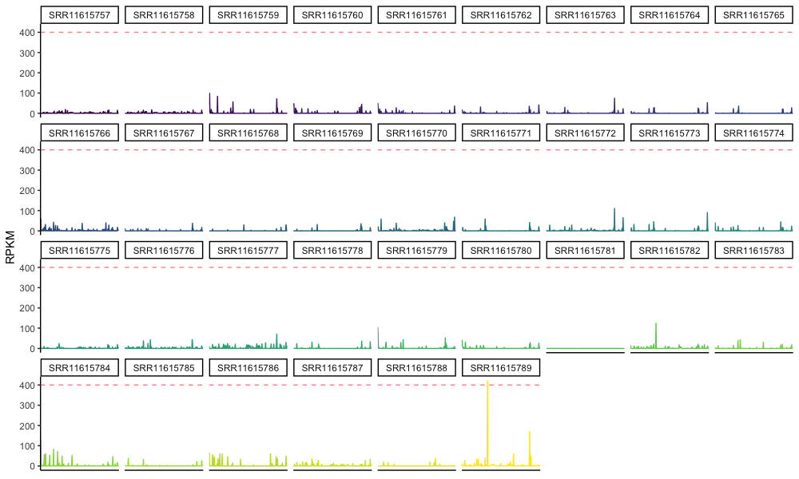
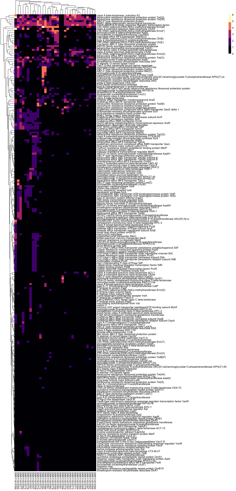

# AMRFinder scripts
AMRFinder result analytic workflow

## Motivation
[AMRFinder plus](https://www.ncbi.nlm.nih.gov/pathogens/antimicrobial-resistance/AMRFinder/) is a tool that takes a set of gene sequence data and returns an output table of high confidence matches to reference sequences or hidden markov models (HMM) for antimicrobial resistance and virulence determinants.  This workflow documents input parameters for upstream steps to produce AMRFinder results for reproducibility as well as custom python scripts written to process output tables for downstream analysis and visualization.

## Overall workflow:
1. Prepare reads for assembly
2. Assembly
3. Predict genes
4. Annotate genes with AMRFinder
5. Estimate in-situ gene coverage with CoverageMagic workflow
6. Post-processing

	1. filter for complete genes ([00_amrfinder_filter.py](https://github.com/michaelwoodworth/AMRFinder_scripts/blob/master/01_amrfinder_binary_matrix.py))
	2. create binary presence/absence matrix ([01_amrfinder_binary_matrix.py](https://github.com/michaelwoodworth/AMRFinder_scripts/blob/master/01_amrfinder_binary_matrix.py))
	3. estimate relative abundance of identified AMR genes ([02_amrfinder_validate_and_summarize_RPKM.py](https://github.com/michaelwoodworth/AMRFinder_scripts/blob/master/02_amrfinder_validate_and_summarize_RPKM.py))

7. Analysis in R
8. Produce figures in R

## Workflow detail

### 1. Prepare reads for assembly
Since I work with human-associated metagenomes, in addition to trimming with trimmomatic, I usually attempt to remove reads aligning to reference human genomes.  This can be efficiently done in one step with the Huttenhower lab tool [kneaddata](https://huttenhower.sph.harvard.edu/kneaddata/).

```console
# test
kneaddata --input $R1 --input $R2 --run-bmtagger --remove-intermediate-output -db $db_path --output $outdir

# for loop
for ID in `cat acc_list.txt`; do R1=${indir}/${ID}_1.fastq; R2=${indir}/${ID}_2.fastq; kneaddata --input $R1 --input $R2 --run-bmtagger --remove-intermediate-output -t 10 --reference-db $db_path -o $outdir; echo $ID complete.; done

```

### 2. Assembly
I primarily assemble genomes and metagenomes with [SPAdes](https://cab.spbu.ru/software/spades/).


- consider [renaming scaffolds](https://github.com/rotheconrad/00_in-situ_GeneCoverage) for streamlined labeling downstream (and MagicBlast compatibility)

``` console
# test
python 01a_Fasta_rename_sequences.py -i ${ID}_scaffolds.fasta -p ${ID}

# for loop
for ID in `cat acc_list.txt`; do python 01a_Fasta_rename_sequences.py -i ${ID}_scaffolds.fasta -p ${ID}; done

```

### 3. Predict genes
Gene prediction at the metagenome, metagenome-assembled genome (MAG), and genome level are performed using [Prodigal](https://github.com/hyattpd/Prodigal) or PROKKA.

```console
########## (Prodigal example) 

# test
prodigal -a ${ID}.faa -d ${ID}.fna -f gff -i ${scaffold} -o ${ID}.gff -p meta

# for loop
for ID in `cat acc_list.txt`; do scaffold=${indir}/${ID}/scaffolds.fasta; prodigal -a ${ID}.faa -d ${ID}.fna -f gff -i ${scaffold} -o ${ID}.gff -p meta; echo $ID complete.; done

```

### 4. Annotate genes with AMRFinder
Genes predicted in step 3 are then analyzed with [AMRFinder plus](https://www.ncbi.nlm.nih.gov/pathogens/antimicrobial-resistance/AMRFinder/).

```console

#test
amrfinder -p ${ID}.faa --plus -o ${outdir}/${ID}_amrfinder.tsv

#loop
for ID in `cat acc_list.txt`; do amrfinder -p ${indir}/${ID}.faa --plus -o ${outdir}/${ID}_amrfinder.tsv; echo $ID complete.; done

```

### 5. Estimate gene RPKM with CoverageMagic workflow (for metagenomes)
Genes predicted in step 3 from a metagenome/genome as well as metagenome/genome reads file and filtered tabular magicblast output file are used to estimate AMRFilter-detected gene RPKM using the [CoverageMagic in situ gene coverage workflow](https://github.com/rotheconrad/00_in-situ_GeneCoverage/tree/6812ebd32c5127ce8b72ba8e520799b75f45c895).

### 6. Post-processing

**1. 00_amrfinder_filter.py** - this python script was written because AMRFinder produces some hits that are incomplete genes that may reduce confidence of your results.  This may be fine in an exploratory analysis, but for my purposes, I prefer to filter only hits that AMRFinder classifies as "ALLELE", "EXACT", "BLASTX", "HMM", which is the default usage.

- *add_partial_end*: 
This script allows users to also include AMRFinder hits that were partial but located at the end of a contig sequence, which could be consistent with a sequencing/assembly issue of a gene that may be complete in host.  This option is flagged with the -m add_partial_end option.

- *just_amr*:
The -j/--just_AMR flag filters and writes a tsv file with just AMR results.

- *virulence_stress*:
The -v/--virulence_stress flag filters and writes a tsv file with non-AMR results.

```console
usage: 00_amrfinder_filter.py [-h] -i  -o  [-m] [-j] [-v]

Filter AMRFinder Plus results for high confidence matches.

This script filters AMRFinder output tables for matches, with
default criteria focused on high quality & complete matches.
e.g. >90% identity, >90% match length.

Script options also allow filtering for just AMR determinants,
or conversely, only non-AMR results (e.g. virulence/stress).

optional arguments:
  -h, --help            show this help message and exit
  -i , --input          Please specify AMRFinder input tsv file name & path.
  -o , --output         Please specify AMRFinder filtered prefix & path for
                        output tsv.
  -m , --method         Please specify filtered AMRFinder output tsv file name
                        & path. Select from: complete -or- add_partial_end
  -j, --just_AMR        Flag to write tsv with just AMR results
  -v, --virulence_stress
                        Flag to write tsv without AMR results (e.g. filter
                        only virulence, stress)

```

```console
# Example usage
for ID in `cat ${list_pth}/IDlist.txt`; do echo $ID; python ${script_path}/00_amrfinder_filter.py -i ${indir}/${ID}_amrfinder.tsv -o ${outdir}/${ID} -m add_partial_end -j -v; done
```

**2. 01_amrfinder_binary_matrix.py** - this python script searches for .tsv files in an input directory and produces a binary presence/absence matrix for all genes across all samples coded as 0 for absent and 1 as present.

This step is useful for genomes or metagenomes if relative abundance data aren't of primary interest/available.

*Note: using relative paths for writing the output tsv can throw an error.  To avoid this, use absolute paths or environmental variables instead.*

```console
usage: 01_amrfinder_binary_matrix.py [-h] -i INPUT -o OUTPUT [-v]

Create summary matrix of AMRFinder Plus results for plots & analysis.

This script sumamrizes filtered tables from 00_amrfinder_filter.

optional arguments:
  -h, --help      show this help message and exit
  -i , --input    Please specify input directory path.
  -o , --output   Please specify output filename & path.
  -v, --verbose   Increase output messaging detail, print results.
```

```console
# Example usage
python ${script_path}/01_amrfinder_binary_matrix.py -i ${00_filtered_path} -o ${01_output_path}/01_binary_matrix.tsv
```

**3. 02_amrfinder_validate_and_summarize_RPKM.py** - this python script performs two main tasks.

- First, a validation step is completed to confirm the presence of all AMRFinder-detected genes in the [in situ gene coverage workflow](https://github.com/rotheconrad/00_in-situ_GeneCoverage/tree/6812ebd32c5127ce8b72ba8e520799b75f45c895) ${unique_id}gene_RPKM.tsv output file.

- Second, [RPKM](https://sites.google.com/site/wiki4metagenomics/pdf/definition/rpkm-calculation) values are tallied for duplicate gene names within a sample (which is printed to STDOUT if the verbose option is selected) and then used to construct a matrix of RPKM values with rows ov unique genes by columns of metagenomes.

```console
usage: 02_amrfinder_validate_and_summarize_RPKM.py [-h] -a  -m  -o  [-v] [-V]

Validate and summarize RPKM of AMRFinder-detected genes 
for plots & analysis.

This script takes the following inputs:
- directory containing filtered AMRFinder tsv files
  (output from step 00)
- directory containing ${uniqueID}_gene_RPKM.tsv files
  (https://github.com/rotheconrad/00_in-situ_GeneCoverage)

With intermediate validation steps (option -V):

- all genes input in AMRFinder tables are tested against all genes 
in the coverage_magic tsv files. If there are any genes that are 
not in the submitted coverage_magic tsv files, these are optionally 
output as: genes_to_validate.tsv

- all duplicated gene RPKM values are summed by sample.  
Input contigs/scaffolds hosting the detected genes are listed with
the summed (deduplicated) RPKM values and gene sequence name and
output as: deduplicated_RPKM.tsv

Genes that have RPKM values are returned with following output:
- specified output file & path containting a single tsv file with 
length / effort normalized AMR gene abundance (RPKM)

optional arguments:
  -h, --help            show this help message and exit
  -a , --amrfinder_tsv_path 
                        Please specify directory path containing filtered
                        AMRFinder tsv files.
  -m , --coverage_magic_path 
                        Please specify directory path containing coverage
                        magic path.
  -o , --output         Please specify output file path (& optional prefix).
  -v, --verbose         Toggle volume of printed output.
  -V, --validate        Write genes_to_validate.tsv and deduplicated.tsv.
```

```console
# Example usage
python ${script_path}/02_amrfinder_validate_and_summarize_RPKM.py -i ${00_filtered_path} -o ${02_output_path}/${prefix} -v -V
```

### 8. Figures in R

These steps walk through production of a gene RPKM lineplot and heatmap.  Of note, the heatmap step is also a useful way to present presence/absence of gene binary matrix tables from step 6.2 (01_amrfinder_binary_matrix.py) if working with genomes or if gene coverage is not of primary interest.

- Data needs to be loaded in R with package dependencies (after installation).

```R
# load packages
library(tidyverse)
library(pheatmap)
library(viridis)
library(MEP)

# specify default color scales
scale_colour_discrete <-  function(...){
  scale_colour_viridis(discrete=TRUE, ...)
}
scale_fill_discrete <-  function(...){
  scale_fill_viridis(discrete=TRUE, ...)
}


# load file paths
RPKM_tsv_path <- "<replace string between quotes with your path>"
metadata_path <- "<replace string between quotes with your path>"    

# import tsvs
RPKM_matrix <- read_delim(paste(RPKM_tsv_path, "RPKM_matrix.tsv", sep=""), "\t", escape_double = FALSE, trim_ws = TRUE)


# add matrix rownames for pheatmap
RPKM_m <- RPKM_matrix %>% select(-1)
rownames(RPKM_m) <- RPKM_matrix$X1

# get sample prefixes using MEP package function
sample_prefixes <- get_prefix(colnames(RPKM_m), sep="_", HMP=TRUE)

# pivot_longer, without log-transformation
RPKM_mL <- RPKM_m %>% 
  rownames_to_column(var="Gene.name") %>% 
  pivot_longer(cols = c(-Gene.name),
               names_to="Sample",
               values_to="RPKM")

# pivot_longer, log-transformed
RPKM_ml <- log(RPKM_m +1) %>% 
  rownames_to_column(var="Gene.name") %>% 
  pivot_longer(cols = c(-Gene.name),
               names_to="Sample",
               values_to="RPKM")
```

- Facet-wrapped line plots of gene RPKM values by sample can be a helpful way to show distributions or explore your data.

```R
# facet wrapped lineplots of RPKM by gene, sample, patient
RPKM_lineplot <- RPKM_mL %>% ggplot(aes(x=Gene.name, y=RPKM,
                                        group=Sample, color=Sample)) +
  geom_line() + 
  geom_hline(yintercept=400, linetype="dashed", alpha=0.5, color = "Red") +
  facet_wrap(~Sample, ncol=9) +
  theme_classic() +
  theme(axis.title.x = element_blank(),
        axis.text.x  = element_blank(),
        axis.ticks.x = element_blank(),
        legend.position = "none"
  )
RPKM_lineplot

# facet wrapped lineplots of log(RPKM) by gene, sample, patient
log_RPKM_lineplot <- RPKM_ml %>% ggplot(aes(x=Gene.name, y=RPKM,
                                        group=Sample, color=Sample)) +
  geom_line() + 
  facet_wrap(~Sample, ncol=9) +
  theme_classic() +
  theme(axis.title.x = element_blank(),
        axis.text.x  = element_blank(),
        axis.ticks.x = element_blank(),
        legend.position = "none"
  )
log_RPKM_lineplot
```

*Example output from re-analysis of data from a randomized trial of fecal microbiota transplantation for eradication of carbapenem-resistant (CR) bacterial colonization.*



- [Pheatmap](https://cran.r-project.org/web/packages/pheatmap/pheatmap.pdf) is an R package that supports clustering, value scaling, and annotation of rows and columns with metadata.

```R
# heatmaps with pheatmap

# plot RPKM heatmap
pheatmap(RPKM_m,
         color = magma(5))

# plot log(RPKM) heatmap
pheatmap(log(RPKM_m + 1),
         color = magma(5))
```

*Example log-transformed heatmap from re-analysis of data from a randomized trial of fecal microbiota transplantation for eradication of carbapenem-resistant (CR) bacterial colonization.*


